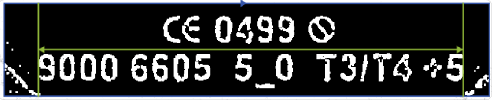
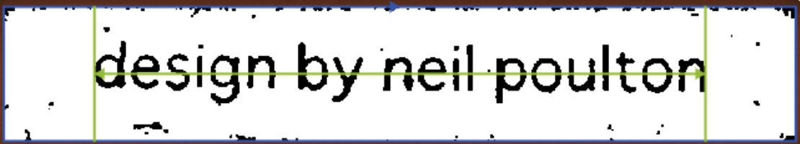
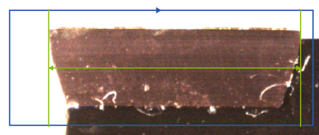
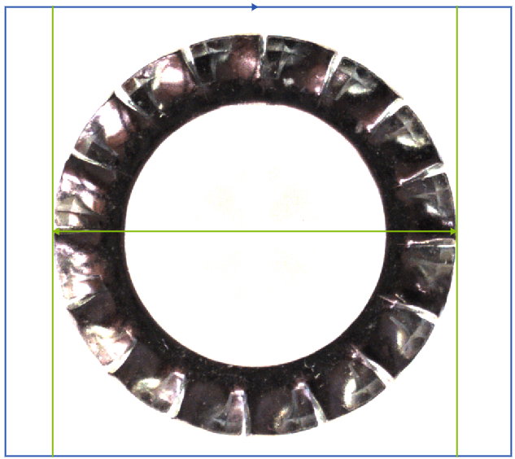
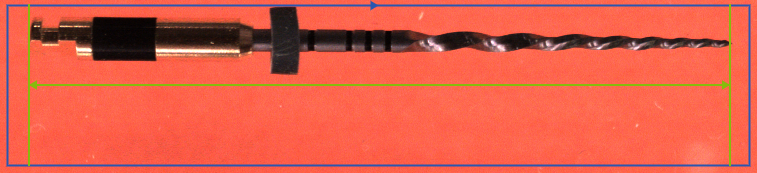
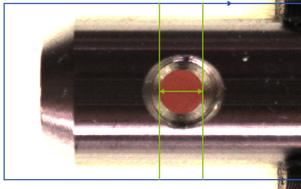

--------------------------

# Objectifs

- étudier les objets proposés et leurs caractéristiques,
- réfléchir à la meilleure manière de les acquérir (positionnement, éclairage, etc.),
- effectuer des prises de vues,
- manipuler les paramètres d'acquisition pour améliorer la qualité des images obtenues,
- effectuer des mesures sur les images obtenues et les comparer aux valeurs réelles,
- débriefing.

# Objets à l'étude

Pour chaque objet :

- effectuez une prise de vue et les réglages nécessaires pour obtenir une image de qualité (cadrage, alignement de l'objet, mise au point, éclairage, reflets, etc.),
- calibrez correctement votre système de vision pour que les mesures soient précises
- mesurez par vision la largeur de l'objet et comparez à la valeur réelle ; notez les valeurs mesurées et réelles dans le tableau idoine


## Plaque blanche



**Explications sur le contexte de la prise de vue :**

``` 

``` 

| Définition | Résolution | Largeur théorique [mm] | Largeur mesurée [mm] | Erreur [%] |
| ---------- | ---------- | ---------------------- | -------------------- | ---------- |
|            |            |                        |                      |            |

## Pièce orange

 

**Explications sur le contexte de la prise de vue :**

``` 

``` 

| Définition | Résolution | Largeur théorique [mm] | Largeur mesurée [mm] | Erreur [%] |
| ---------- | ---------- | ---------------------- | -------------------- | ---------- |
|            |            |                        |                      |            |

## Outil de coupe



**Explications sur le contexte de la prise de vue :**

``` 

``` 

| Définition | Résolution | Largeur théorique [mm] | Largeur mesurée [mm] | Erreur [%] |
| ---------- | ---------- | ---------------------- | -------------------- | ---------- |
|            |            |                        |                      |            |

## Rondelle



**Explications sur le contexte de la prise de vue :**

``` 

``` 


| Définition | Résolution | Largeur théorique [mm] | Largeur mesurée [mm] | Erreur [%] |
| ---------- | ---------- | ---------------------- | -------------------- | ---------- |
|            |            |                        |                      |            |
    
## Fraise dentaire



**Explications sur le contexte de la prise de vue :**

``` 

``` 


| Définition | Résolution | Largeur théorique [mm] | Largeur mesurée [mm] | Erreur [%] |
| ---------- | ---------- | ---------------------- | -------------------- | ---------- |
|            |            |                        |                      |            |

## Cylindre



**Explications sur le contexte de la prise de vue :**

``` 

``` 


| Définition | Résolution | Largeur théorique [mm] | Largeur mesurée [mm] | Erreur [%] |
| ---------- | ---------- | ---------------------- | -------------------- | ---------- |
|            |            |                        |                      |            |
